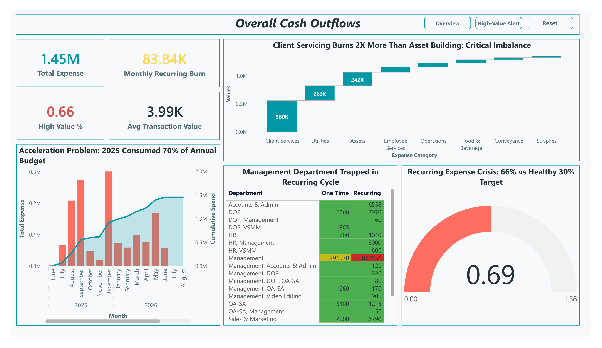
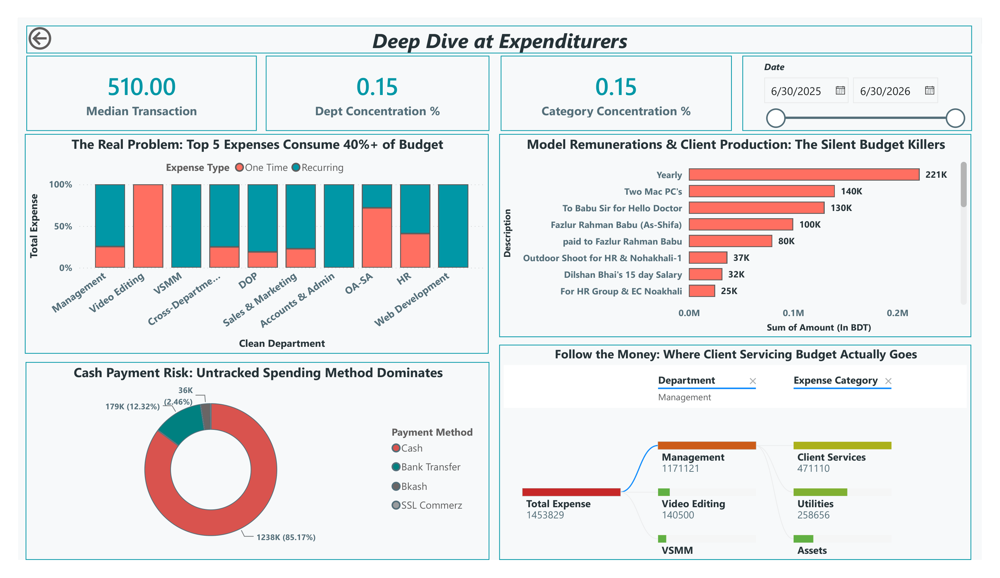

# 💰 Agency Expense Burn Analysis | Power BI Financial Analytics Dashboard

> An executive Power BI dashboard designed to investigate agency expense burn, recurring commitments, departmental spending, payment-method risk, and cost-control opportunities.


---

## 📌 About the Project

This project was built around a practical financial-control problem faced by a media buying agency.

The underlying expense data contained transactions across different departments, expense categories, transaction types, and payment methods. The challenge was to turn that transactional information into something management could actually use to understand where money was being consumed and where financial risk was building up.

Rather than creating a conventional expense report, I designed a two-page Power BI dashboard around questions such as:

- Where is the agency's budget being consumed?
- How much spending is tied to recurring commitments?
- Which departments account for the largest share of expenditure?
- Which individual expenses require closer attention?
- How exposed is the business to cash-payment risk?
- Where should management focus its cost-control efforts?

---

## 🎯 Business Objective

The main objective was to **identify the root causes of budget burn, highlight high-risk spending patterns, and provide management with a clearer framework for expense control.**

The dashboard therefore focuses on four areas:

**Expense Burn → Recurring Exposure → Spending Risk → Management Action**

---

# 📊 Dashboard
## Executive Overview



## Expenditure Deep Dive


The report consists of two main analytical pages.

## 01 — Executive Overview

The first page provides a high-level view of the agency's overall expenditure position.

### Key metrics

- Total Expense
- Monthly Recurring Burn
- High-Value Expense %
- Average Transaction Value

### Analysis included

- Expense burn by category
- Cumulative spending trajectory
- Recurring expense exposure
- Department-level recurring commitments

The page is designed for a management-level question:

> **Where is the agency's financial pressure coming from?**

---

## 02 — Expenditure Deep Dive

The second page moves from the overall financial picture into detailed expense investigation.

### Analysis included

- One-Time vs Recurring expenditure by department
- Top individual expenses
- Department-level spending
- Payment-method distribution
- Expense concentration
- Department × Expense Category analysis
- Date-based expenditure analysis

Interactive navigation and drill-through functionality allow the user to move from the high-level view into more detailed expense investigation.

---

# 🔎 Analytical Highlights

The dashboard surfaces several important patterns in the expense data.

### Recurring Expense Exposure

Recurring expenditure represents a significant share of the agency's overall spending structure, creating a potential constraint on management's ability to reduce costs quickly.

### Departmental Concentration

Management represents the largest departmental expense concentration in the analyzed data, making it an important area for further review.

### High-Value Expense Concentration

The dashboard isolates large individual transactions so that management can investigate the expenses with the greatest potential impact on overall budget burn.

### Payment Method Risk

Cash represents the dominant payment method in the dataset, accounting for approximately **85.17%** of analyzed payment value.

This creates an important financial-control consideration because cash transactions are more difficult to monitor and audit than traceable electronic payments.

---

# 🛠️ Technical Implementation

## Data Preparation

The source expense data was prepared before being brought into the Power BI reporting environment.

The preparation process focused on:

- Cleaning transaction records
- Standardizing relevant fields
- Preparing expense classifications
- Organizing department and expense attributes
- Ensuring the dataset was suitable for analysis in Power BI

---

## DAX & Business Logic

This dashboard is intentionally **DAX-centric**.

Custom DAX logic was used to create reusable business metrics and analytical calculations rather than relying only on raw aggregation.

Examples include:

- Total Expense
- Monthly Recurring Burn
- Average Transaction Value
- High-Value Expense %
- Department Expense
- Category Expense
- Expense Concentration %
- Recurring vs One-Time analysis
- Dynamic expense ranking
- Comparative expense metrics

The purpose of the DAX layer was to turn transactional expense data into measures that could be reused across multiple visuals and analytical views.

---

# 🎛️ Interactivity

The report includes interactive Power BI functionality designed to make the dashboard useful beyond static reporting.

### Bookmark Navigation

Bookmark buttons allow users to switch between different analytical perspectives without relying on a large number of visible slicers.

### Drill-Through Analysis

Drill-through functionality allows users to move from summary-level expense information into more detailed records and investigate the underlying transactions.

### Interactive Filtering

Users can explore the report by relevant dimensions such as department, expense category, expense type, payment method, and date.

---

# 🎨 Dashboard Design

The visual design was built around an executive reporting approach.

Key design decisions include:

- Insight-driven visual titles
- KPI-first layout
- Clear visual hierarchy
- Semantic use of color
- Horizontal layouts for long category names
- Minimal visual clutter
- Bookmark-based navigation
- Drill-through for deeper investigation

The intention was to make the dashboard answer a business question quickly rather than requiring management to interpret every chart independently.

---

# 📈 Key Metrics

The dashboard provides management with visibility into metrics such as:

| Metric | Purpose |
|---|---|
| Total Expense | Measures overall expenditure |
| Monthly Recurring Burn | Identifies recurring financial commitments |
| High-Value Expense % | Measures concentration of significant spending |
| Average Transaction Value | Provides transaction-level spending context |
| Department Expense | Identifies major departmental cost centers |
| Category Expense | Shows where spending is concentrated |
| Payment Method | Highlights payment-control exposure |
| Expense Concentration | Identifies dependence on a smaller number of expenses |

---

# 💡 Business Recommendations

The analytical findings were translated into practical management actions.

### 1. Strengthen Payment Controls

Increase the use of traceable electronic payment methods for higher-value transactions to improve financial visibility and auditability.

### 2. Review Recurring Commitments

Audit recurring vendor payments, retainers, subscriptions, and other fixed commitments to identify expenses that can be renegotiated, reduced, or discontinued.

### 3. Investigate High-Value Transactions

Introduce additional review of unusually large individual expenses before treating them as routine operating expenditure.

### 4. Monitor Departmental Spending

Use recurring management reporting to identify departments where expenditure is growing disproportionately or where recurring commitments are becoming excessive.

---

# 📂 Dataset

The project uses an agency expense dataset containing transactional expenditure information.

Relevant analytical fields include information relating to:

- Transaction amount
- Department
- Expense category
- Expense type
- Payment method
- Description
- Date
- Recurring / One-Time classification

The dataset is included in the repository for transparency and reproducibility.

---

# 🧰 Tools Used

- **Microsoft Power BI** — Dashboard development and interactive reporting
- **DAX** — Business measures and analytical calculations
- **Power Query** — Data cleaning and preparation
- **Microsoft Excel** — Source data environment

---

# 📁 Repository Structure

```text
agency-expense-burn-analysis-powerbi/
│
├── README.md
│
├── Agency Expense Burn Analysis.pbix
│
├── Agency Expense Burn Analysis - Case Study.pdf
│
├── General Expense Report.xlsx
│
└── images/
    ├── executive-overview.png
    └── expenditure-deep-dive.png
